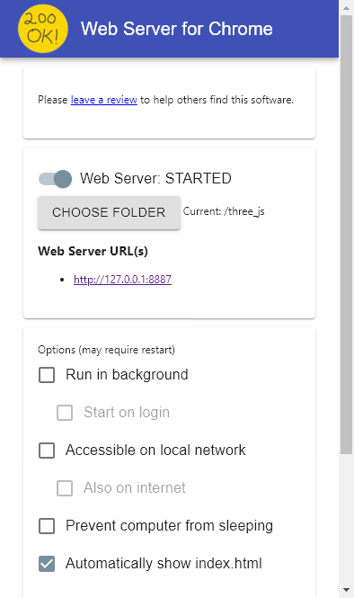
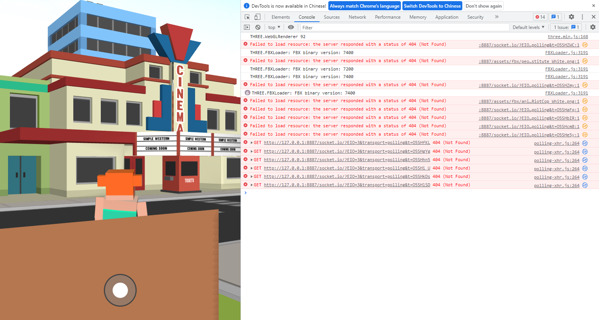

# Three.js文档

## 目录介绍

- assets-资源文件
- dev-资源文件
- empty_scene内置一个空场景
- libs依赖文件
- socketio_chatroom_demo内置一个socketio的聊天室demo
- town_scene完整的城镇场景
- node内含node相关的，但资源路径调配未完成，如果修改成功请删除该句

## 使用说明

- 由于该项目需要在服务器才能使用，要打开有两个途径
  - 使用node.js，如果你对node熟悉的话
  - 在chrome应用商店搜索应用web server for chrome

choose folder可以选择文件夹，之后直接访问url即可。

## 现有问题

- socketio同步失败

若解决请删除。思路：检查socketio传输内容和广播。应该是由于笔者囫囵吞枣没学全引起的低级错误。

- 根据需要完成的八皇后问题update场景并制作交互